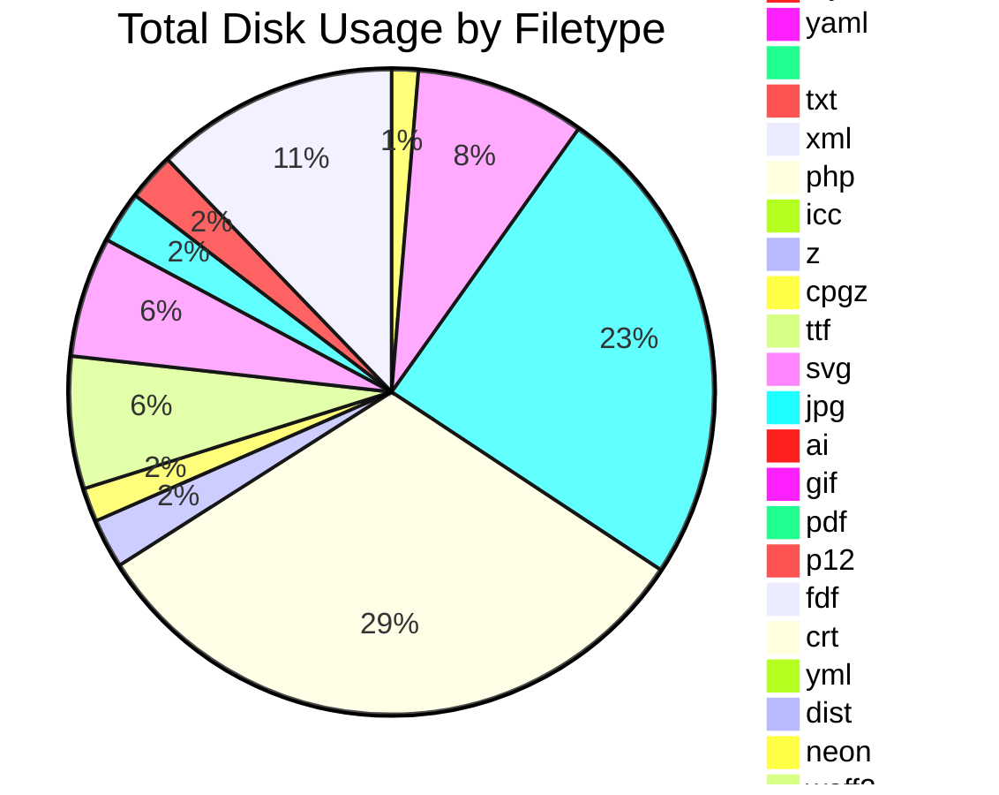
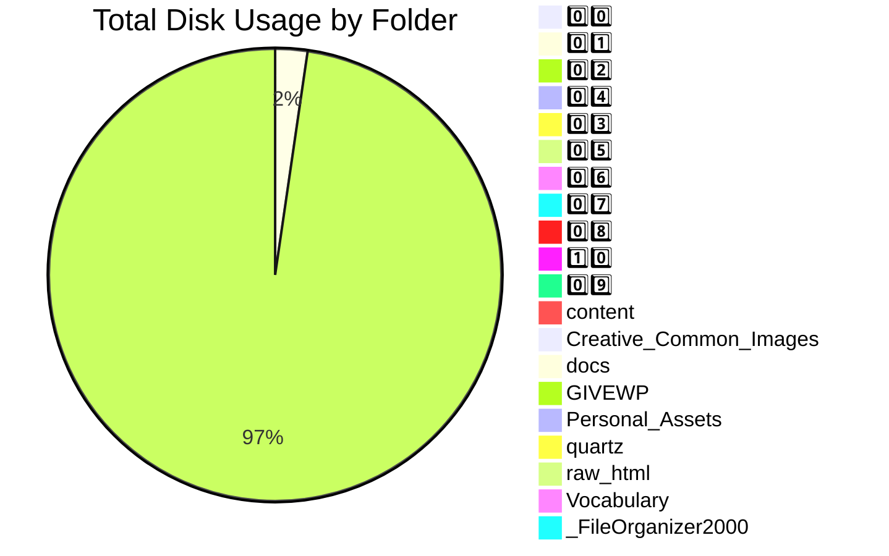
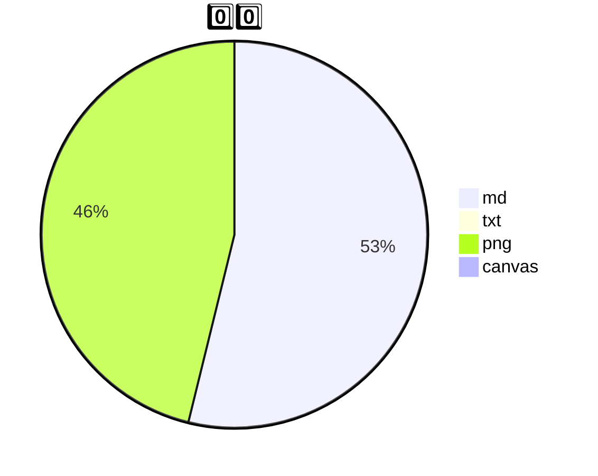
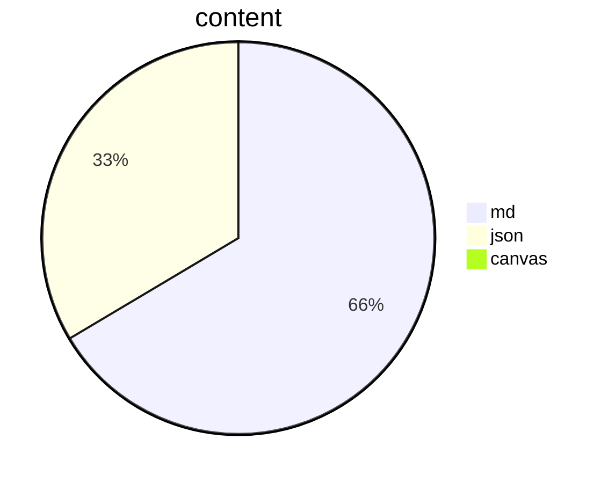
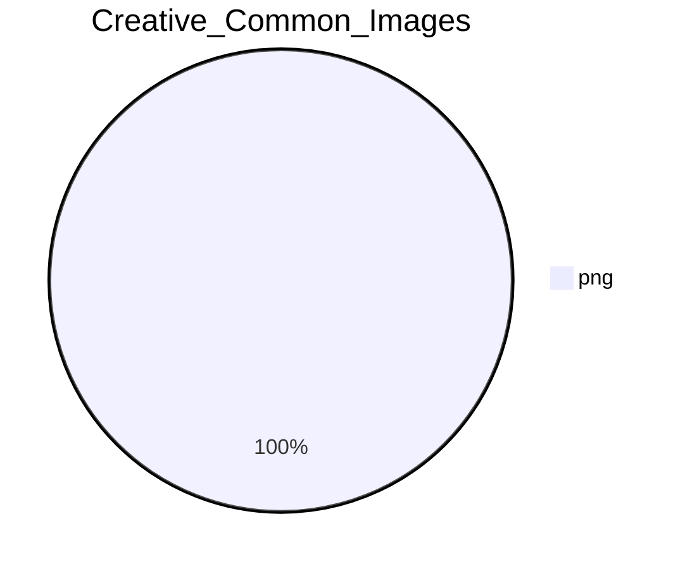
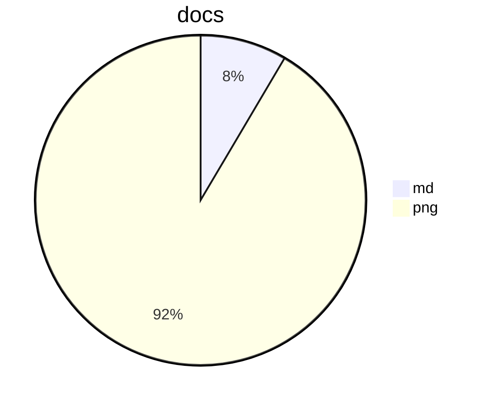
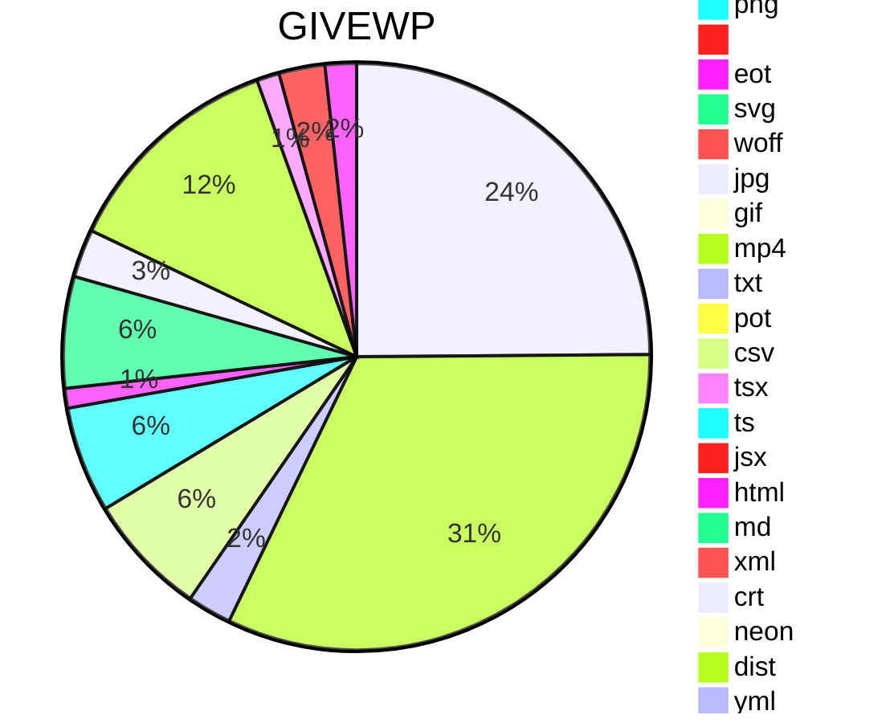
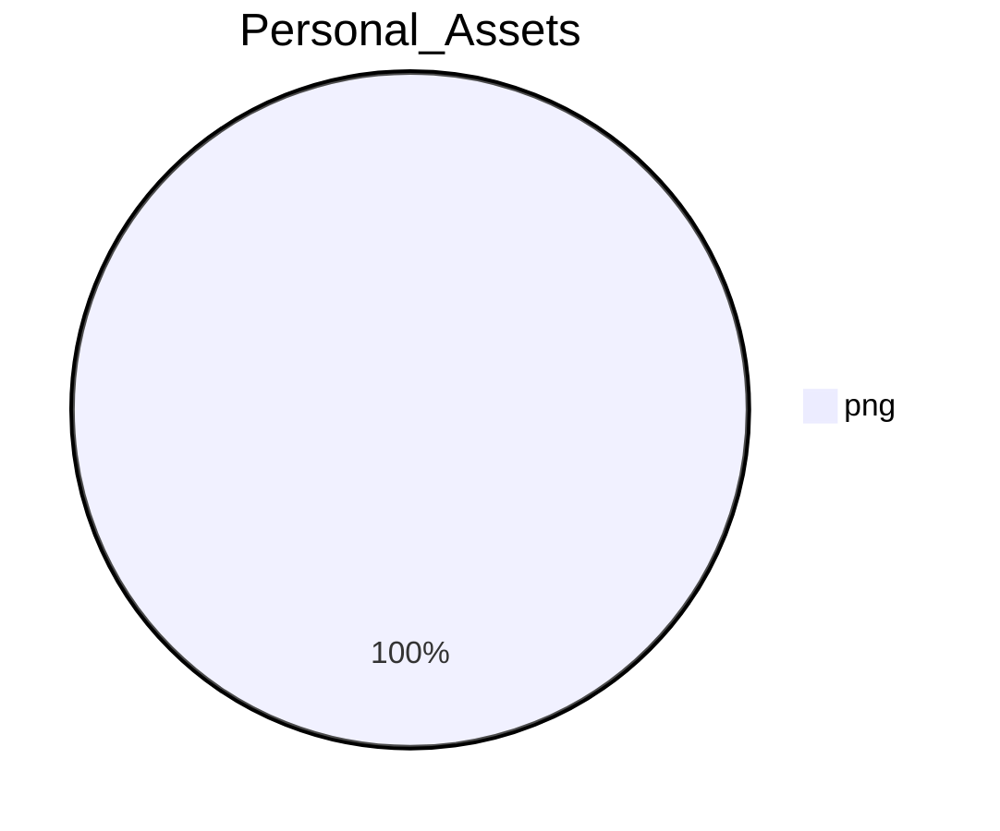
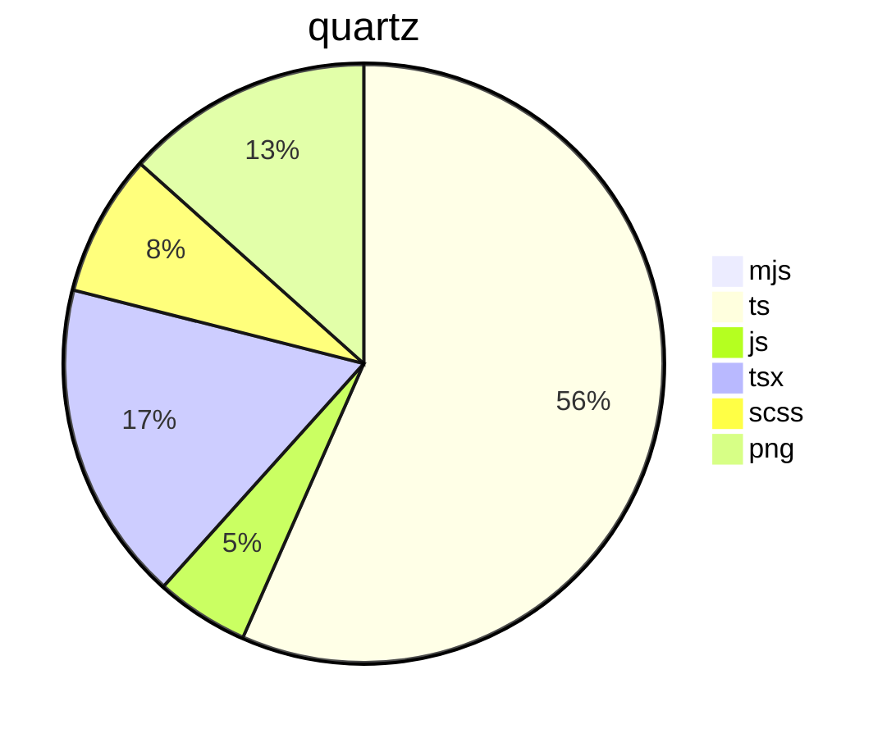
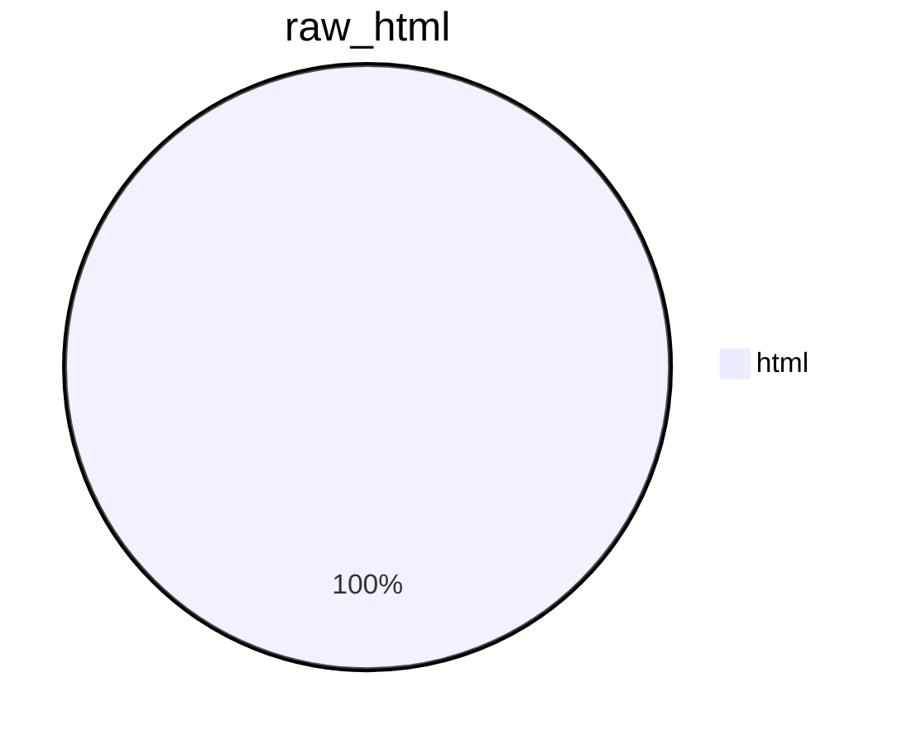

>[!abstract] Summary
Total space taken up in KLDalton-Obsidian-Quartz-Project is 73.68MB. PHP files take up the most space followed by JS files. Largest folder is GIVEWP followed by docs. Keep in mind this does not include your hidden .obsidian folder and plugins.

## Vault Total



## Folder By Filetype


```mermaid
pie title 0️⃣1️⃣
	"md" : 0
```

```mermaid
pie title 0️⃣2️⃣
	"md" : 0
```

```mermaid
pie title 0️⃣4️⃣
	"md" : 0
```

```mermaid
pie title 0️⃣3️⃣
	"md" : 0
```

```mermaid
pie title 0️⃣5️⃣
	"md" : 0
```

```mermaid
pie title 0️⃣6️⃣
	"md" : 0
```

```mermaid
pie title 0️⃣7️⃣
	"md" : 0
```

```mermaid
pie title 0️⃣8️⃣
	"md" : 0
```

```mermaid
pie title 1️⃣0️⃣
	"md" : 0
```

```mermaid
pie title 0️⃣9️⃣
	"md" : 0
```















```mermaid
pie title Vocabulary
	"md" : 25
```

```mermaid
pie title _FileOrganizer2000
	"md" : 1540
```

